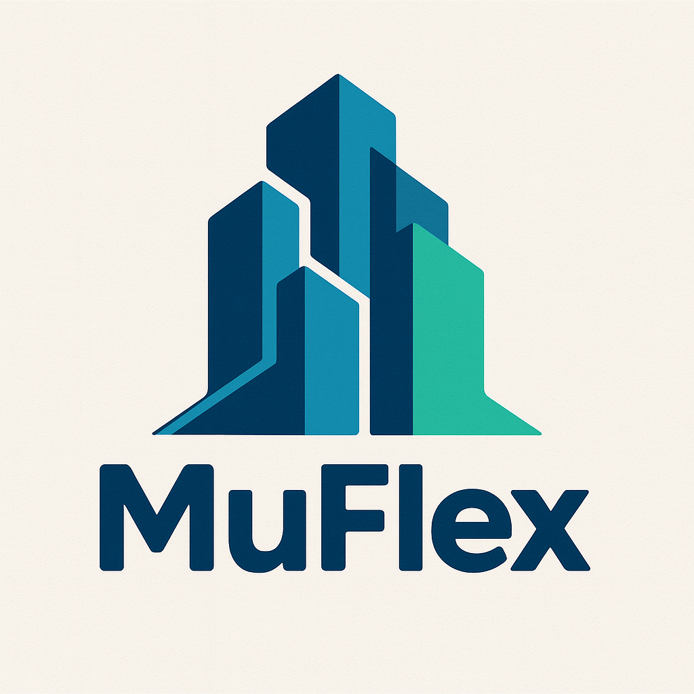

# MuFlex
**A Scalable, Physics-based Platform for Multi-Building Flexibility Analysis and Coordination** 🚀

<p align="center">
  
</p>

---
## 📰 News
🎉 **Accepted by *Energy*** — **February 2026**  
🔗 **Paper (DOI):** https://doi.org/10.1016/j.energy.2026.140565


---

## ⚙️ Installation (Windows)
### ✅ Step 1 - Download Repo
```bash
# Clone the repository
git clone https://github.com/BuildNexusX/MUFLEX.git
cd MUFLEX

# Create and activate a Python 3.12 environment (Conda recommended)
conda create -n MUFLEX python=3.12 -y
conda activate MUFLEX
```
### ✅ Step 2 - Install packages
Run the commands listed in requirements/install.txt 

### ✅ Step 3 - EnergyPlus 9.2.0 Setup
To run models provided in MuFlex, you must install EnergyPlus v9.2.0 and add the EnergyPlus folder to your PATH.

#### - Download & Install EnergyPlus 9.2.0
- Download **EnergyPlus v9.2.0** from:  
  https://github.com/NatLabRockies/EnergyPlus/releases/tag/v9.2.0
- Install it on your machine.

#### - Add EnergyPlus to PATH (Both System & User)
On **Windows**, add the EnergyPlus installation directory to **both**:
- **System variables** → **Path**
- **User variables** → **Path**

Typical example (may vary depending on your install location):
- `C:\EnergyPlusV9-2-0\`

❗ Make sure the folder you add contains `energyplus.exe` (i.e., the EnergyPlus “root” install folder).

#### - Restart Your Computer
After updating PATH, **restart your computer** to make sure the new environment variables take effect.

---
## 🔁 Reproduce Paper Experiments

### 📂 Paper Results
The control-performance results for:
- SAC (RL controller)
- Baseline controller 
- Scalability tests

are saved in:
- `paper_result/`

### 📂 Models Used in the Paper

#### Demand Limiting Case Study (4-Building Cluster)
The four buildings used in the case study are stored in:
- `models/small_office/`
- `models/medium_office/`

#### Platform Scalability Test (50-Building Cluster)
The 50-building scalability benchmark is stored in:
- `models/scalability/`

It includes:
- 10 Modelica residential models from Energym
- 40 replicated EnergyPlus prototype buildings (derived from the case-study EnergyPlus prototypes)

### 📂 Weather Files
All experiments use the weather files in:
- `models/weather/`

### ✅ Compatibility Information
MuFlex has been tested with all models (FMUs) provided in the `models/` directory of this repository.
These FMUs are exported from EnergyPlus and Modelica building models.

---
## 🤖 RL Implementation

### 🧩 Workflow of how RL agent interacts with MuFlex environment:

```python

from src.env_wrapper import MuFlex                            ⎫
fmu_configs = [{'io_type': 'OfficeS', 'path': '...'},         ⎪
               {'io_type': 'OfficeS', 'path': '...'},         ⎪
               {'io_type': 'OfficeM', 'path': '...'},         ⎪
               {'io_type': 'OfficeM', 'path': '...'}]         ⎪
                                                              ⎪  
env = MuFlex(                                                 ⎪  This setup can be configured via `MuFlex.py` GUI ▶️
    fmu_configs=fmu_configs,                                  ⎪  (GUIs introduced in the next Section)
    sim_days=1,                                               ⎪  and will be saved to `src/env_list.txt` for easy reuse
    start_date=201,                                           ⎪
    step_size=900,                                            ⎪
    action_type='continuous',                                 ⎪
    include_hour=True,                                        ⎪
    include_day_of_year=True,                                 ⎪
    include_episode_progress=True,                            ⎪
    normalize_observation=True,                               ⎪
    reward_mode='example_reward'                              ⎪
)  
  
from stable_baselines3 import SAC
model = SAC("MlpPolicy", env=env)
model.learn(total_timesteps=200_000)
model.save()

env.close()
```
### 🧩 Customize Reward Functions

MuFlex supports plug-and-play reward scripts. To add your own reward:
1. Create a new script in `algo/reward/` named `xxx_reward.py`
2. Set `reward_mode="xxx_reward"` when creating the environment

For example, the paper uses:
- `algo/reward/demand_limiting_reward.py`  →  `reward_mode="demand_limiting_reward"`

### 🧩 Observation & Action Spaces (Auto-loaded)

Once you select the simulated models (i.e., `fmu_configs` with `io_type` + `path`), MuFlex will **automatically build** the RL **action space** and **observation (state) space** based on the I/O definitions stored in `config/fmu_config.json`.

- **Action space** is constructed by concatenating all FMU **INPUTS**:
  - `action_type="continuous"` → `spaces.Box(low=-1, high=1, shape=(total_inputs,))`
  - `action_type="discrete"` → `spaces.MultiDiscrete(dims_per_input)`
- **Observation (state) space** is constructed by concatenating environment-provided time features and all FMU **OUTPUTS**.
  - If `normalize_observation=True`, the returned observation is normalized to `[0, 1]`.
  - If `normalize_observation=False`, the returned observation keeps its raw physical values.

#### ⏰ Environment-provided time observations
MuFlex can prepend three types of time features to the observation vector:

- `include_hour=True` adds:
  - `sin(hour_of_day)`
  - `cos(hour_of_day)`

- `include_day_of_year=True` adds:
  - `sin(day_of_year)`
  - `cos(day_of_year)`

- `include_episode_progress=True` adds:
  - `episode_progress`

By default, all three switches are enabled, so MuFlex prepends **5 time-feature dimensions**:

```text
[hour_sin, hour_cos, day_of_year_sin, day_of_year_cos, episode_progress]
```

---

## 🖥️ GUIs Overview (Two Tools)

**MuFlex** provides two lightweight GUIs:

- **GUI 1 — `MuFlex.py`**:  **quickly manage RL environments** (create / save / delete), and to **run the baseline controller** for a fast check of model simulations using created environments.
- **GUI 2 — `Add_FMU.py`**:  **register new model types** (define their inputs/outputs and bounds) so they can be used in MuFlex simulations.


## 🖥️ GUI 1 — MuFlex.py (Envs Manager + Baseline Runner)

▶️ `python MuFlex.py`

### 🔌 Tab 1 - Create & Save RL Environment
- Select FMU types (defined in `Add_FMU.py`) and provide FMU paths
- Set simulation horizon (days, start day-of-year, step size)
- Choose action type (`continuous` / `discrete`)
- Configure observation options
- Choose reward mode (default or custom)
- Name and save the environment (saved to `src/env_list.txt`)

### 🔌 Tab 2 - Run Baseline Controller
- Select a saved environment
- Configure baseline run settings:
- Specify fixed baseline actions for each FMU
- Run to verify the model runs correctly before RL training

### 🔌 Tab 3 - Manage Environments
- List saved environments
- Delete outdated ones  
  *(Note: the built-in `example` env is the one used in the paper.)*


## 🖥️ GUI 2 — Add_FMU.py (Register New Models)

▶️ `python Add_FMU.py`

### What is an FMU “type”?
A *type* is a template describing an FMU’s **input/output interface**.  
FMUs with different variables (different I/O) should be registered as different types.

### What you define (stored in `config/fmu_config.json`)
- `INPUTS` / `OUTPUTS` – controllable inputs and observable outputs
- `ob_base_low` / `ob_base_high` – output bounds for observation normalization
- `dims` – discrete bins per input (for `action_type="discrete"`)
- `intervals` – action step size (continuous actions snap to these intervals)
- `base_mins` / `base_maxs` – physical min/max limits for each input

### 🔌Tab 1 -  Browse existing types
### 🔌Tab 2 - Add / edit / remove a type
### 🔌Tab 3 - Save back to `config/fmu_config.json`

---
## 📚 Citation

If you use **MuFlex**, please cite our paper:

**Wu Z, Korolija I, Tang R, _MuFlex: A Scalable, Physics-based Platform for Multi-Building Flexibility Analysis and Coordination_, Energy, https://doi.org/10.1016/j.energy.2026.140565**

---

## 📝 License

[](LICENSE)

This project is released under the **MIT License**. See [`LICENSE`](LICENSE) for details.

---

### *Feel free to open issues, submit pull requests, or start a discussion. Happy Coding!* 🎉
